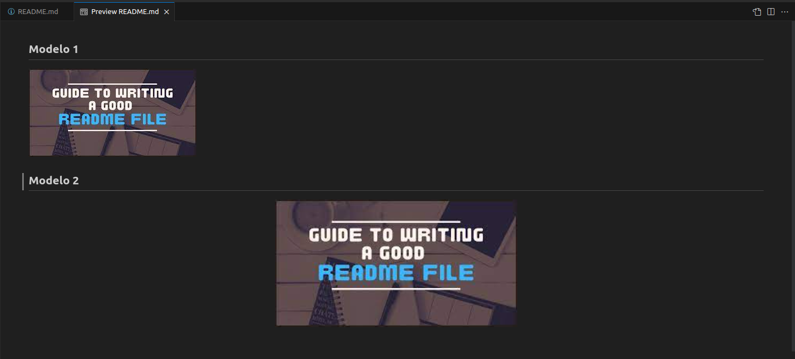

# Projeto de Documentação

## :memo: Descrição do Projeto

Um arquivo README é uma parte essencial de qualquer projeto de software, oferecendo informações cruciais para desenvolvedores, colaboradores, PO's entre outros. Ele atua como um guia seja incial para entender o projeto, sua finalidade e como utilizá-lo. Neste guia, discutiremos como criar ou melhorar a documentação em seu projeto, abordando cada seção considerada necessária do arquivo README de maneira clara e eficaz.

Lembre-se de que um README bem elaborado não apenas torna o projeto mais acessível, mas também ajuda novos integrantes, expões padrões e sua organização. Invista tempo na criação de um README informativo e organizado para maximizar o valor do projeto em que você atual.

